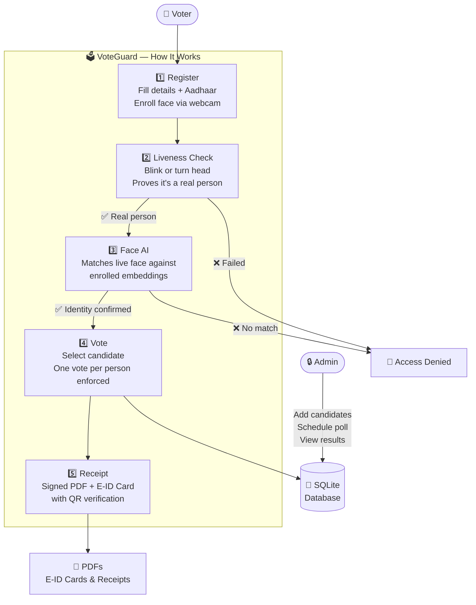

<div align="center">

# 🗳️ VoteGuard

### AI-Based Facial Recognition Voting System

[](https://python.org)
[](https://flask.palletsprojects.com)
[](https://opencv.org)
[](https://sqlite.org)
[](LICENSE)

*A secure, browser-based electronic voting platform with real-time facial recognition, active liveness detection, and cryptographic Aadhaar verification.*

</div>

---

## 📌 Overview

VoteGuard is a full-stack electronic voting system that replaces traditional ballot authentication with **AI-powered face recognition**. Voters register with their Aadhaar ID, enroll their face through their webcam, and authenticate using a **liveness-gated face verification** pipeline before casting their vote. Every vote produces a cryptographically signed acknowledgement slip (PDF) and a scannable voter E-ID card.

The system uses **OpenFace embeddings** + **grouped cosine similarity** for accurate multi-frame face matching, and implements **active liveness detection** (blink / head-turn challenges) directly in the browser to defeat spoofing attacks.

---

## ✨ Key Features

### 🧠 AI / Face Recognition
- **OpenCV DNN SSD** face detector (Caffe model) with configurable confidence threshold
- **OpenFace `nn4.small2.v1`** 128-D embedding extraction for robust identity matching
- **Grouped multi-frame cosine similarity** — scores across all enrolled frames, uses top-K median for noise resistance
- **Score-margin gating** — rejects ambiguous matches where the top-2 candidates are too close
- **Duplicate enrollment detection** — prevents multiple accounts sharing the same face

### 🛡️ Liveness Detection
- Active **challenge-response** system: blink, turn left, or turn right
- **Browser-side metrics** (EAR for blink, horizontal delta for head-turn)
- **Server-side frame validation** using DNN face tracking and motion analysis
- Configurable time window, grace period, and movement thresholds

### 🗳️ Voting Engine
- **One vote per person** enforced at the DB level
- **Face verification required** before every vote cast
- **Poll scheduling** — configurable start/end times with manual override
- **Real-time results** view for administrators

### 📄 Document Generation
- **Voter E-ID Card** (credit-card-sized PDF, QR-linked to public verification endpoint)
- **Voting Acknowledgement Slip** (PDF with verification hash and QR code)

### 🔐 Security
- **HMAC-SHA256 Aadhaar hashing** — raw Aadhaar numbers never stored
- **Bcrypt password hashing** via Werkzeug
- **Session management** with Flask signed sessions
- **Admin registration secret** prevents unauthorized admin account creation
- **Secure filename validation** for all file uploads
- **HTTPS support** via `ENABLE_HTTPS` flag (adhoc SSL for dev/mobile testing)

### 🖥️ Admin Panel
- Add candidates with party name, symbol, and manifesto PDF
- Configure poll start/end times and toggle manually
- Voter management with CSV bulk-import
- Voter E-ID generation and verification
- Vote receipt verification

---

## 🛠️ Technology Stack

| Layer | Technology |
|---|---|
| **Backend** | Python 3.8+, Flask 3.0, Werkzeug |
| **Face Detection** | OpenCV DNN (Caffe SSD ResNet-10) |
| **Face Embeddings** | OpenFace `nn4.small2.v1.t7` (128-D) |
| **Database** | SQLite 3 (via Python `sqlite3`) |
| **PDF Generation** | ReportLab (receipts + E-ID cards with QR) |
| **Frontend** | Vanilla HTML5, CSS3, JavaScript (ES6+) |
| **Security** | HMAC-SHA256, `hashlib`, `cryptography`, Werkzeug PBKDF2 |
| **Testing** | pytest |
| **ML Utilities** | NumPy, scikit-learn |

---

## ⚙️ Installation

### Prerequisites

- Python **3.8 or higher**
- Webcam (720p or higher recommended)
- Windows, Linux, or macOS

### 1. Clone the Repository

```bash
git clone https://github.com/your-username/voteguard.git
cd voteguard
```

### 2. Create a Virtual Environment

```bash
python -m venv venv

# Windows
venv\Scripts\activate

# Linux / macOS
source venv/bin/activate
```

### 3. Install Dependencies

```bash
pip install -r requirements.txt
```

### 4. Download Required Model Files

VoteGuard uses two pre-trained models that are **not included** in this repository due to file size.

**Face Detector (OpenCV DNN SSD):**
```bash
# Place in: models/face_detector/
curl -L -o models/face_detector/res10_300x300_ssd_iter_140000.caffemodel \
  https://github.com/opencv/opencv_3rdparty/raw/dnn_samples_face_detector_20170830/res10_300x300_ssd_iter_140000.caffemodel
```

**Face Embeddings (OpenFace):**
```bash
# Place in: models/face_embedding/
curl -L -o models/face_embedding/openface_nn4.small2.v1.t7 \
  https://storage.cmusatyalab.org/openface-models/nn4.small2.v1.t7
```

### 5. Configure Environment Variables

Copy the example environment file and fill in your values:

```bash
cp .env.example .env
```

Edit `.env`:
```dotenv
SECRET_KEY=your-strong-random-secret-key
AADHAR_HASH_SECRET=your-strong-hmac-secret
ADMIN_REGISTRATION_SECRET=your-admin-registration-secret
LIVENESS_ENABLED=true
ENABLE_HTTPS=false
```

### 6. Run the Application

```bash
python app.py
```

For HTTPS (required for camera access on mobile devices):
```bash
ENABLE_HTTPS=true python app.py
```

### 7. Access the Application

| Endpoint | URL |
|---|---|
| Landing Page | `http://localhost:5000` |
| Admin Login | `http://localhost:5000/admin/login` |
| Voter Login | `http://localhost:5000/user/login` |

---

## 🔑 Default Credentials

> [!WARNING]
> Change the admin password immediately after first login in any deployment.

| Role | Email | Password |
|---|---|---|
| Admin | `admin@voting.com` | `admin` |

---

## 📖 Usage Guide

### For Administrators

1. **Log in** at `/admin/login`
2. **Add Candidates** — Navigate to *Candidates* → provide name, party, upload symbol image and optional manifesto PDF
3. **Configure Poll** — Set start/end time or use the manual toggle in *Poll Settings*
4. **Import Voters** — Upload a CSV with columns `aadhar_number,email,phone` to pre-assign eligible voters
5. **Monitor Results** — Real-time vote counts visible in *Results*
6. **Verify Receipts & E-IDs** — Use the verification panel to validate voter documents

### For Voters

1. **Register** at `/user/login` → *Register to Vote*
   - Fill in: first/last name, email, password, phone, 12-digit Aadhaar
   - Upload an optional profile photo
2. **Enroll Face** — Follow the on-screen webcam capture (50 frames captured automatically)
3. **Log In** — Choose Email/Password or Face Recognition
   - Face login triggers liveness challenge (blink or head-turn) before recognition
4. **Vote** — Click *Start Voting* → complete face verification → select candidate → confirm
5. **Download Receipt** — A signed PDF acknowledgement slip is generated immediately
6. **Get E-ID Card** — Download your Voter E-ID card from your home page (QR links to public verification)

---

## 🏗️ Project Structure

```
voteguard/
├── app.py                          # Flask app factory & entrypoint
├── config.py                       # All configuration (env-var backed)
├── requirements.txt                # Python dependencies
├── .env.example                    # Environment variable template
├── LICENSE
├── README.md
│
├── models/
│   ├── database.py                 # All SQLite operations
│   └── face_detector/
│       ├── deploy.prototxt         # DNN face detector config
│       └── (download caffemodel)   # → See Installation Step 4
│
├── modules/
│   ├── face_capture.py             # Webcam enrollment & burst capture
│   ├── face_detector.py            # OpenCV DNN SSD wrapper
│   ├── face_embeddings.py          # OpenFace extraction + matching logic
│   ├── face_recognition.py         # High-level identify/verify API
│   ├── id_card_generator.py        # Voter E-ID PDF (ReportLab)
│   ├── liveness.py                 # Active liveness challenge-response
│   ├── pdf_generator.py            # Voting receipt PDF (ReportLab)
│   └── security.py                 # HMAC Aadhaar hashing & masking
│
├── routes/
│   ├── admin.py                    # Admin blueprint (/admin/*)
│   ├── candidates.py               # Manifesto serving (/candidates/*)
│   ├── user.py                     # Voter blueprint (/user/*)
│   └── voting.py                   # Voting blueprint (/voting/*)
│
├── static/
│   ├── css/style.css               # Global stylesheet (dark theme)
│   ├── js/
│   │   ├── liveness.js             # Browser liveness detection
│   │   └── main.js                 # UI utilities & interactions
│   ├── img/voteguard-mark.svg      # App logo
│   └── uploads/                    # Runtime-generated (git-ignored)
│       ├── face_dataset/           # Enrolled face images per voter
│       ├── id_cards/               # Generated E-ID PDFs
│       ├── manifestos/             # Uploaded manifesto PDFs
│       ├── party_symbols/          # Uploaded party symbol images
│       ├── profile_photos/         # Voter profile photos
│       └── receipts/               # Generated voting receipt PDFs
│
├── templates/
│   ├── error.html
│   ├── index.html                  # Landing page
│   ├── verify_voter_public.html    # Public E-ID QR verification
│   ├── admin/                      # Admin panel templates (9 pages)
│   └── user/                       # Voter-facing templates (8 pages)
│
├── tests/
│   ├── conftest.py
│   ├── test_admin_poll_upload.py
│   ├── test_eid_routes.py
│   ├── test_embeddings.py
│   ├── test_face_capture_dataset.py
│   ├── test_face_routes.py
│   ├── test_liveness.py
│   └── test_security.py
│
├── database/
│   └── migrate_aadhar.py           # One-time migration utility
│
└── voter_assignment_sample.csv     # Sample voter CSV format (anonymized)
```

---

## 🗄️ Database Schema

| Table | Description |
|---|---|
| `users` | Voter records — name, email, HMAC-hashed Aadhaar, Aadhaar last4, phone, voting status |
| `candidates` | Candidate details — name, party, symbol path, manifesto path, vote count |
| `votes` | Vote records — user ID, candidate ID, timestamp |
| `admin_users` | Admin credentials |
| `face_embeddings` | Per-frame 128-D OpenFace embeddings linked to each voter |
| `poll_settings` | Election schedule — start/end times, manual toggle, active flag |
| `vote_receipts` | Receipt hash, user/candidate linkage, timestamp |
| `face_recognition_logs` | Recognition attempt analytics — scores, margins, outcomes |

---

## 🧠 System Architecture



---

## ⚙️ Configuration Reference

All configuration lives in `config.py` and can be overridden via environment variables:

| Variable | Default | Description |
|---|---|---|
| `SECRET_KEY` | *(insecure default)* | Flask session signing key |
| `AADHAR_HASH_SECRET` | *(insecure default)* | HMAC secret for Aadhaar hashing |
| `ADMIN_REGISTRATION_SECRET` | *(insecure default)* | Secret required to register new admins |
| `LIVENESS_ENABLED` | `true` | Enable/disable liveness gating |
| `LIVENESS_CHALLENGE_WINDOW_SECONDS` | `8` | Time window for liveness challenge |
| `LIVENESS_SUBMISSION_GRACE_SECONDS` | `12` | Grace period for submission after window |
| `LIVENESS_MIN_FACE_FRAMES` | `6` | Minimum face frames needed server-side |
| `LIVENESS_HEAD_TURN_THRESHOLD` | `0.08` | Minimum horizontal movement ratio |
| `ENABLE_HTTPS` | `false` | Enable adhoc SSL (for mobile camera access) |

---

## 🔧 Running Tests

```bash
pytest tests/ -v
```

---

## 🔮 Future Enhancements

- [ ] **Email OTP verification** during registration
- [ ] **SMS notifications** for vote confirmation
- [ ] **Multi-language support** (Hindi, regional languages)
- [ ] **Advanced embedding models** (FaceNet, ArcFace) for higher accuracy
- [ ] **Rate limiting & CSRF protection** for production hardening
- [ ] **Blockchain-anchored vote receipts** for cryptographic audit trail
- [ ] **PostgreSQL support** for multi-server deployments

---

## 🛡️ Security Notes

> [!CAUTION]
> This system is an educational / portfolio project. For real election use, additional hardening is mandatory.

- All Aadhaar numbers are stored as **HMAC-SHA256 hashes** with only the last 4 digits retained for display
- Raw biometric face images are stored server-side in `static/uploads/face_dataset/` — secure this directory appropriately in production
- Change all default credentials and secrets before any deployment
- Enable HTTPS in production — facial data must never transit over plaintext HTTP

---

## 📝 License

This project is licensed under the **MIT License** — see the [LICENSE](LICENSE) file for details.

---

## 👤 Author

Jay Patel
---

<div align="center">
  <sub>Powered by VoteGuard · Built with Flask & OpenCV</sub>
</div>
